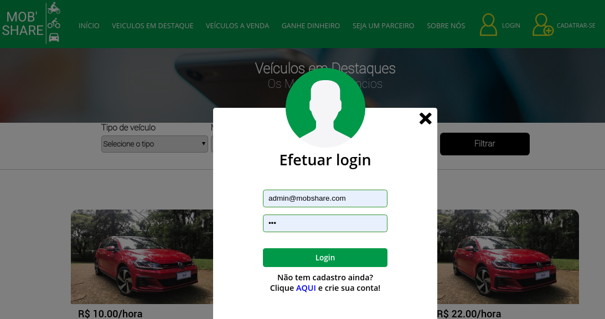

[](https://heroku.com/deploy/?template=https://github.com/gilberto-009199/mobshare)

# MobShare
> ATENÇÃO, essa aplicação e Legada e Não tem quqlquer proteção basica.
> 



Sistema de alugel de carros, basicamente um sitema web para
criar e gerenciar locações de veiculos. Usando **PHP**, **Docker**, **MariaDB** e **JQuery**.

## How Run:

```shell
# in Docker
$ docker-compose up
```

## Bibliotecas

* [PHP](https://www.php.net/manual/pt_BR/intro-whatis.php) - Linguagem de preogramação para desenvolvimento web e muitas outras coisas!
* [Jquery](https://jquery.com) - Biblioteca JS para agilizar a codificação em JS
* [Notify.js](http://notifyjs.com/) - Biblioteca de notificações
